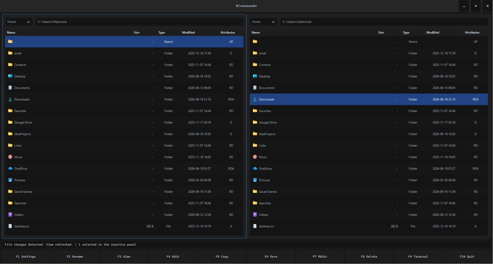

# RCommander




RCommander is a clean, native two-pane file commander written in Rust and GTK4.

It is inspired by classic commander-style file managers such as Norton Commander, Total Commander, and SpeedCommander, but built with a modern Rust codebase, native GTK widgets, and a clear architecture that avoids homemade UI emulation where the operating system or toolkit should provide the right primitive.

The goal is simple: a fast, practical, keyboard-friendly desktop file manager that feels direct, lightweight, and dependable.

## Current Status

RCommander is already usable as a real desktop application, not just a UI prototype. It supports the core commander workflow, native file panels, file operations with progress feedback, file viewing/editing, and initial archive support.

The project is still young and evolving quickly. APIs, internal structure, and feature details may change while the application grows toward a more complete commander experience.

## Features

- Native GTK4 desktop interface
- Classic two-pane commander layout
- Keyboard-oriented workflow
- `F1` settings dialog for application and panel options
- Directory navigation in both panels
- Open files with the system default application
- Rename, create-directory, copy, move, and delete operations
- Progress dialog for longer file operations
- Conflict handling for overwrite, skip, rename, or cancel
- File viewer for text and binary files
- Hex-style viewing for binary files
- UTF-8 text file editing
- ZIP archive support
- RAR archive support through `unrar`
- Windows resource/icon integration
- `F9` terminal toggle and `F10` quit action
- Linux terminal dock backed by a real VTE terminal widget
- Windows terminal dock placeholder with a clean backend boundary for future native terminal integration

## Keyboard Workflow

| Key | Action |
| --- | --- |
| `Tab` | Switch active panel |
| `Enter` | Open directory or launch file with the default application |
| `F1` | Open settings |
| `F2` | Rename selected file or directory |
| `F3` | View selected file |
| `F4` | Edit UTF-8 text file |
| `F5` | Copy selected item to the opposite panel |
| `F6` | Move selected item to the opposite panel |
| `F7` | Create a directory in the active panel |
| `F8` | Delete selected item |
| `F9` | Toggle the terminal dock |
| `F10` | Quit the application |

## Technology

RCommander uses a native GTK4 stack through gtk-rs.

The file panels are built with GTK's modern list and column infrastructure instead of a custom table implementation:

- `gio::ListStore`
- `gtk::MultiSelection`
- `gtk::ColumnView`
- `gtk::SignalListItemFactory`

The project currently depends on:

- `gtk4` for the desktop UI
- `sourceview5` for text viewing/editing support
- `notify` for filesystem event handling
- `zip` for ZIP archive support
- `unrar` for RAR archive support via the bundled UnRAR library/license
- `windows-sys` for Windows-specific integration
- `vte4` for the Linux terminal backend

## Build

### Requirements

You need a working Rust toolchain and GTK4 development files.

On Windows, make sure the GTK4 runtime and development files are installed and visible to `pkg-config` before building from source.

On Linux, install the GTK4 and VTE development packages provided by your distribution.

### Build from Source

```powershell
git clone https://github.com/anjunar/rust-commander.git
cd rust-commander
cargo check
cargo run
```

For an optimized build:

```powershell
cargo build --release
```

The resulting binary will be located in:

```text
target/release/
```

## Windows Notes

RCommander is developed with Windows as an important target platform.

The application can be distributed through an installer so end users do not have to set up a Rust development environment. Developers building from source still need the GTK4 development setup.

The embedded terminal is intentionally not implemented as a fake textbox-based terminal emulator on Windows. Microsoft's ConPTY provides a pseudoconsole stream, but the host application would still have to implement terminal rendering, input encoding, scrollback, selection, cursor behavior, and control sequence handling.

RCommander avoids that class of homemade terminal emulation. The Windows terminal direction is to integrate a proper native terminal host/control behind the existing terminal backend boundary.

More details are documented in [WINDOWS_TERMINAL_STRATEGY.md](./WINDOWS_TERMINAL_STRATEGY.md).

## Linux Notes

On Linux, the terminal dock can use `vte4`, giving RCommander a real terminal widget instead of a custom terminal renderer.

### Ubuntu 24.04 Setup

On Ubuntu 24.04, install the native development packages before building:

```bash
sudo apt-get update
sudo apt-get install -y \
  build-essential \
  pkg-config \
  libgtk-4-dev \
  libgraphene-1.0-dev \
  libgtksourceview-5-dev \
  libvte-2.91-gtk4-dev \
  libunrar-dev
```

Or use the helper script in this repository:

```bash
./packaging/linux/setup-ubuntu.sh
```

Then build and run normally:

```bash
cargo check
cargo run
```

## Archive Support

RCommander currently includes initial archive support for:

- ZIP files
- RAR files through `unrar`

The architecture should grow toward a broader archive adapter layer so additional formats can be added cleanly without hardwiring every compressor or archive backend into the file panel logic.

## Design Principles

RCommander follows a few strict design principles:

- Use native toolkit widgets where possible
- Keep the commander UI responsive during long operations
- Keep file operation logic separate from UI rendering
- Avoid fake implementations for complex platform features
- Prefer clean backend boundaries over quick hacks
- Keep the application lightweight and direct

## Roadmap

Planned and possible next steps:

- Broader archive backend architecture
- Additional archive formats
- Improved large-file viewer behavior
- Better Windows packaging
- Native Windows terminal integration
- More commander-style power features
- More polish for keyboard navigation and selection behavior
- Better file operation reporting and error recovery

## License

The Rust code in this repository is intended to be available under the MIT License.

RAR support is implemented through the `unrar` crate, which wraps the bundled UnRAR C/C++ library. That embedded UnRAR library uses its own license and is not plain MIT.

If you distribute builds or source packages with RAR support enabled, you should include and comply with the UnRAR license text in addition to the MIT license for the Rust parts.

References:

- `Cargo.toml` declares the Rust project metadata as `MIT`
- `unrar` documents that the embedded UnRAR library uses its own license
- UnRAR license: <https://github.com/muja/unrar.rs/blob/master/unrar_sys/vendor/unrar/license.txt>
